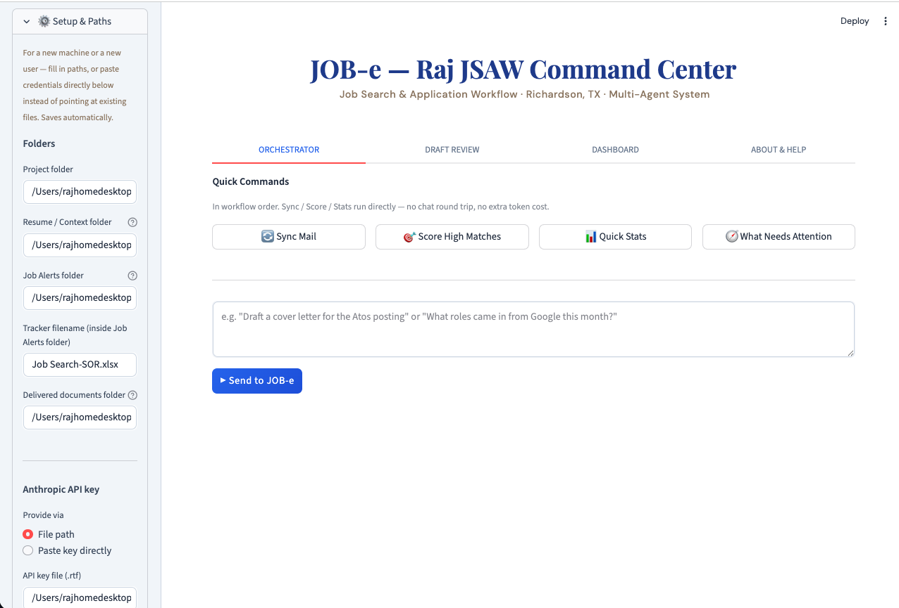
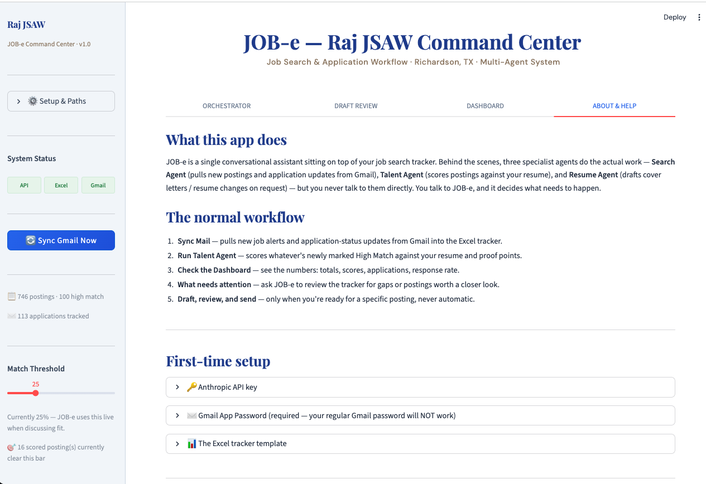

# JSAW — Job Search Agentic Workflow and AI Assitant JOB-e

A conversational multi-agent job search assistant. **JOB-e** is the single entry point you talk to; three specialist agents (Search, Talent, Resume) work in the background as tools JOB-e calls based on what you actually ask — there's no fixed pipeline to run top to bottom. One Excel file is the single source of truth throughout.

## Features

- **Multi-agent orchestration**: JOB-e coordinates a Search Agent, Talent Agent, and Resume Agent as tools, calling only what a request actually needs instead of running a fixed pipeline.
- **Excel-native tracking**: One workbook, two sheets (Job Tracker, Applications & Outcomes), updated in place on every run. Hand-built formatting and dropdowns are never overwritten.
- **Automated Gmail sync**: Pulls new postings and application-status updates via IMAP, using Gmail's server-side search syntax.
- **Guarded web scraping**: Crawls only a company's own careers page or a third-party ATS listing. LinkedIn and Indeed are hard-blocked in code, not just prompted.
- **Resume-aware scoring**: Checklist-style match scoring (0 to 100) against resume and proof-point documents in a Context Hub, with strong and weak points captured per posting.
- **On-demand drafting**: Cover letters and resume-change proposals are generated only when asked for a specific posting, then critiqued by a spawned Company Research Agent before being finalized.
- **Flexible delivery**: Compile to text, docx, or pdf, save it, email it, or both. Nothing is sent automatically.
- **Hybrid model routing**: Lighter models handle search and classification; stronger models handle scoring and drafting, balancing cost against quality.
- **Built-in dashboard**: KPI cards (totals, high match count, average score, applications, response rate) plus a live sheet browser, no charting library required.
- **Conversational control**: No fixed batch sequence. JOB-e decides what needs to run based on what's asked, and flags gaps in the tracker (missing JD summaries, thin scoring) before answering from incomplete data.

## Screenshots

| Orchestrator — Quick Commands | About & Help |
|---|---|
|  |  |

## Architecture

```
                    ┌─────────────────────────────┐
   You  ◄──chat──►  │            JOB-e             │  ◄── gatekeeper of the Excel,
                    │  (tool-calling orchestrator)  │      web_search for ad hoc Qs
                    └───────────┬─────────┬─────────┘
                                │         │
                 ┌──────────────┘         └──────────────┐
                 ▼                                        ▼
        ┌─────────────────┐                      ┌─────────────────┐
        │  Search Agent    │                      │  Talent Agent    │
        │  Gmail → Excel   │                      │  crawl + score   │
        └─────────────────┘                      └─────────────────┘
                                                            │
                                                            ▼
                                                   ┌─────────────────┐
                                                   │  Resume Agent    │
                                                   │  draft, on demand │
                                                   └─────────────────┘
                                                            │
                                              spawns for critique
                                                            ▼
                                                 Company Research Agent
```

All four read/write **one file**: `Job Alerts/Job_Search_-_SOR.xlsx`.

## Setup

1. Place this folder at `/Users/_/Raj JSAW`.
2. `pip install -r requirements.txt && crawl4ai-setup`
3. Secrets: `config/CLAUDE_API_KEY.rtf` (Anthropic key, plain text) and `config/G-Mail.env` (copy from `.example`, fill in `CEO_EMAIL` / `EMAIL_APP_PASSWORD`).
4. Copy `templates/Job_Search-SOR.template.xlsx` to `Job Alerts/Job Search-SOR.xlsx` — `open_job_tracker()` expects this file to already exist and won't create it for you (by design, so your hand-built formatting/dropdowns never get silently overwritten).
5. Drop your resume, proof points, notes — any `.docx`/`.pdf`/`.pptx`/`.xlsx`/`.html`/`.ipynb`/`.md`/`.txt` — into `context_hub/`.
6. Open `Raj_JSAW_Master.ipynb`, run the config cell, then just start talking to JOB-e:
   ```python
   text, history = chat_with_jobe("What high match roles do I have right now?")
   print(text)

   text, history = chat_with_jobe("Draft a cover letter for the Atos one, plain text for now", history=history)
   print(text)
   ```
   Pass `history` back in each call to keep the conversation going.

## The JobTracker Excel

`Job Alerts/Job_Search_-_SOR.xlsx` — **two sheets, one file, updated in place across every run**, never regenerated from scratch:

**"Job Tracker"** (18 columns, Serial # outside the table):
- Written by **Search Agent**: Job Title, Company, Location, Job URL (real clickable hyperlink), Timestamp Captured, Hybrid/Remote/On-site + Actively Recruiting? (where LinkedIn's HTML provides them), High Match (post-hoc label from `search_config.json`, re-applied to every row on each run, not just new ones)
- Written by **Talent Agent**: Date Posted, Open or Closed, Hiring Team / Manager, Pay / CTC / Salary, Job Description Summary, Match Score (0–100), Strong Points, Weak Points
- Written by **Resume Agent**: Cover Created, Resume Updated (Yes/No — set when drafted, not when sent)

**"Applications & Outcomes"**: Serial #, Company, Role, Date Applied, Method, Outcome, Outcome Date, Notes — appended only when you tell JOB-e you actually applied. Never inferred from `Cover Created`.

## What's deliberately different from a normal pipeline

- **No automatic drafting.** Talent Agent scores everything that's High Match; Resume Agent only ever drafts when you explicitly ask for a specific posting.
- **No state persistence for drafts.** Cover letters and resume-change proposals exist only as returned text/conversation until you say to keep one — at which point it's compiled fresh as text/`.docx`/`.pdf` and saved to `Agent output_Updated Cover and resumes/` and/or emailed, never read back from a stored file.
- **No fixed batch sequence.** JOB-e decides what needs to happen based on what you ask — including flagging gaps in the tracker itself (missing JD summary, thin scoring) before answering from incomplete data.
- **Talent Agent never touches LinkedIn/Indeed directly** — hard-blocked in code, not just prompted. Only the company's own careers page or a third-party ATS listing.

## Dashboard

Mirrors TimberLens's actual dashboard (checked directly against its `app.py`), not a heavier custom design — a KPI-card strip and a live sheet browser, no charting library:

```python
render_dashboard()        # KPI cards: totals, High Match, avg score, covers/resumes, applications, response rate
show_sheet("Job Tracker")  # or "Applications & Outcomes"
```

## Notebook structure

| Cell | Contents |
|------|----------|
| Config | Paths, secrets, model routing, `FITMENT_THRESHOLD_PERCENT` (advisory, not a hard gate), `DELIVERY_MODE` |
| Shared Anthropic API helper | `load_skill()`, `call_agent()` |
| File reader | Context Hub ingestion — docx/pdf/pptx/xlsx/html/**ipynb**/md/txt |
| Search Agent | Gmail → Excel, hyperlinks, High Match labeling, Applications tab helper |
| Talent Agent | Enrichment (2 attempts, no fallback, never LinkedIn/Indeed) + scoring |
| Postings summary table | Quick pandas view including new scoring/drafting columns |
| Company Research Agent | Sub-agent spawned by Resume Agent — critiques the cover letter draft |
| Resume Agent | On-demand drafting, text/docx/pdf, none/save/mail/mail+save |
| JOB-e | The tool-calling chat loop — `chat_with_jobe(message, history)` |
| Dashboard | `render_dashboard()`, `show_sheet()` |
| Getting started | One-time Gmail sync + dashboard as a starting point |

## Folder layout

```
Raj JSAW/
  Raj_JSAW_Master.ipynb
  config/
    CLAUDE_API_KEY.rtf, G-Mail.env    git-ignored, you create these
    search_config.json                 title_filters / exclude_keywords
  context_hub/                         any format, including .ipynb now
  skills/                              job-e, search-agent, talent-agent,
                                        resume-agent, company-research-agent
  Job Alerts/
    Job_Search_-_SOR.xlsx              the single source of truth
  Agent output_Updated Cover and resumes/   only what you explicitly kept
  state/                               no draft text — just logs/scratch
  logs/
```
